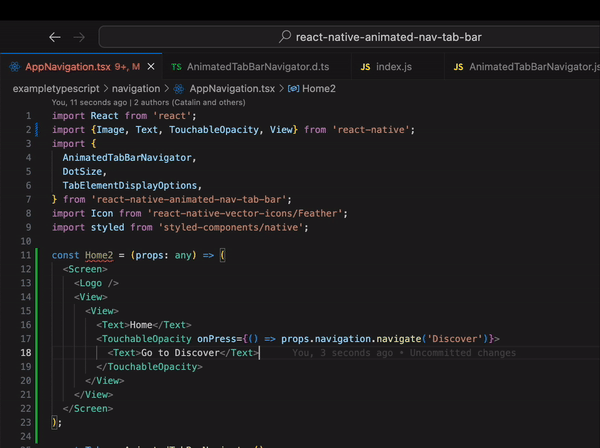

# Add Parent Component

This extensions helps you to add a parent component and you can give any name.

## Features

Select a range of code and right-click to see the option `Àdd Parent Component` in the context menu. Click on it and you will be prompted to enter the name of the parent component. Enter the name and click on `OK`. The parent component will be created and the selected code will be moved to the parent component.

## Requirements

Install this extension from the VS Code Marketplace.

## Release Notes

### 0.0.1

Initial release of Add Parent Component

---

## Contributing

1. Clone the repo
2. `npm i`
3. Press `F5` to open a new window with your extension loaded
4. Test your extension changes on this new window, open a file and add some code, then select a range of code and use the `Àdd Parent Component` option
5. Any changes to the extension code are automatically applied to the extension running on the new window
6. Remeber on this new window, you should press command + R, to reload the window, so that the changes are applied

**Enjoy!**
